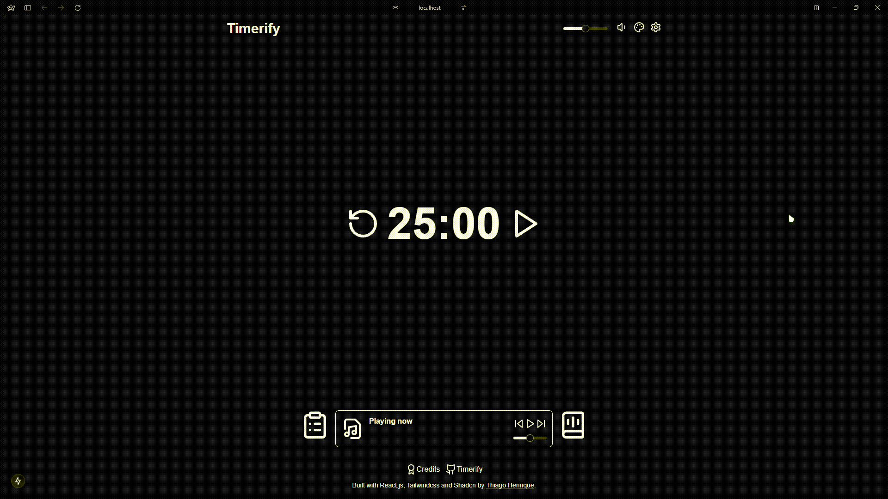
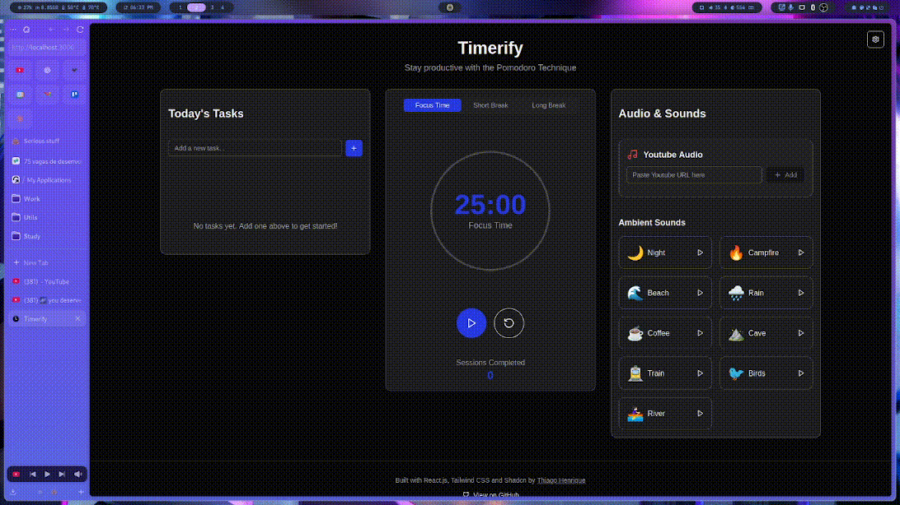
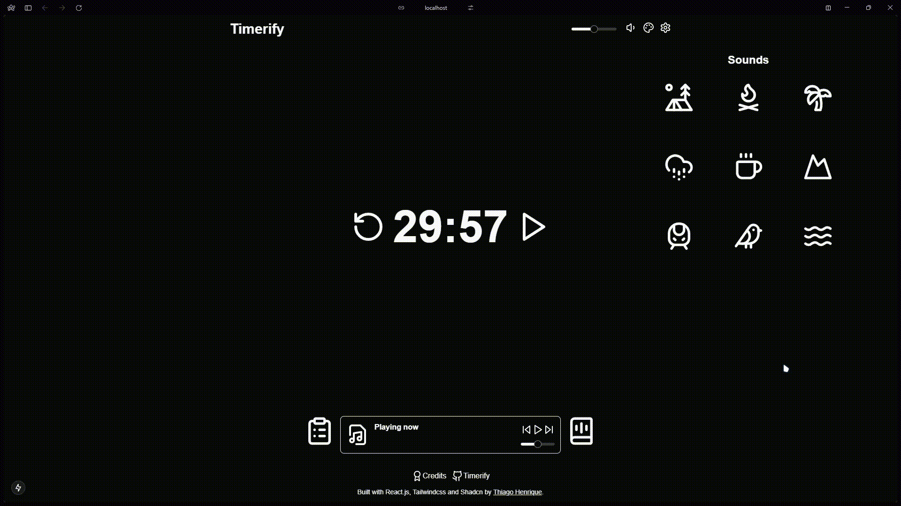

<div align="center">
  

  <h1>Timerify</h1>
  
  <p>
    <strong>Maximize sua produtividade com um pomodoro personalizável e ambiente sonoro imersivo 🎯</strong>
  </p>

  <p>
    <a href="https://timerify.vercel.app/">Ver Demo</a>
    ·
    <a href="https://github.com/ythiago03/timerify/issues">Reportar Bug</a>
    ·
    <a href="https://github.com/ythiago03/timerify/issues">Sugerir Feature</a>
  </p>
</div>

## 📋 Sobre o Projeto

Timerify é uma aplicação web de pomodoro projetada para aumentar sua produtividade durante estudos, trabalho ou qualquer outra atividade que exija foco. Com uma interface intuitiva e recursos personalizáveis, o Timerify oferece uma experiência única para gerenciar seu tempo de forma eficiente.

## ✨ Funcionalidades

### ⏰ Timer Pomodoro Personalizável

- Timer padrão: 25 minutos de foco e 5 minutos de pausa
- Interface intuitiva e minimalista
- Alertas sonoros suaves para início e fim de cada sessão
- Personalize o tempo de foco conforme sua necessidade

### 📝 Gerenciador de Tarefas Integrado

- Crie e organize suas tarefas para cada sessão
- Marque tarefas como concluídas
- Mantenha o foco nos objetivos importantes

### 🎵 Ambiente Sonoro Imersivo

- Sons ambientes relaxantes:
  - Chuva suave
  - Ondas do mar
  - Crepitar de fogueira
  - Sons da floresta
  - Ambiente de café
  - Entre outros
- Controle individual de volume para cada som
- Controle global de volume
- Misture diferentes sons para criar seu ambiente perfeito

### 🎬 Integração com YouTube

- Adicione qualquer vídeo ou playlist do YouTube
- Perfeito para músicas lo-fi, playlists de estudo ou sons ambientes
- Controle de volume independente
- Continue ouvindo mesmo ao minimizar a janela

### 🎨 Temas Personalizados

- Diversos temas disponíveis:
  - Light
  - Dark
  - Forest
  - Lo-fi
  - Entre outros
- Adapte a interface ao seu gosto e ambiente

## 🚀 Tecnologias Utilizadas

- [Next.js](https://nextjs.org/) - Framework React para produção
- [Tailwind CSS](https://tailwindcss.com/) - Framework CSS utilitário
- [YouTube IFrame API](https://developers.google.com/youtube/iframe_api_reference) - API para integração com YouTube
- [Shadcn/ui](https://ui.shadcn.com/) - Biblioteca de componentes

## 🎵 Créditos dos Áudios

| Som Ambiente | Link Original | Autor |
|--------------|---------------|--------|
| Night Ambience | [Link para o áudio original](https://pixabay.com/sound-effects/night-ambience-with-cricket-sound-271304/) | TanwerAman |
| Crackling Fire | [Link para o áudio original](https://pixabay.com/sound-effects/campfire-crackling-fireplace-sound-119594/) | SoundsForYou |
| Sandy Beach | [Link para o áudio original](https://pixabay.com/sound-effects/sandy-beach-calm-waves-water-nature-sounds-8052/) | juliusH |
| Rain Ambience | [Link para o áudio original](https://pixabay.com/sound-effects/calming-rain-257596/) | Liecio | 
| Coffee Shop Ambience | [Link para o áudio original](https://pixabay.com/sound-effects/ambience-coffee-shop-4-17028/) | freesound_community |
| Dripping Water in Cave | [Link para o áudio original](https://pixabay.com/sound-effects/dripping-water-in-cave-114694/) | solarmusic |
| Inside Old Train | [Link para o áudio original](https://pixabay.com/sound-effects/inside-old-train-169418/) | kokoreli777 |
| Dripping Water in Cave | [Link para o áudio original]() | solarmusic |
| Calm Zen River Flowing | [Link para o áudio original](https://pixabay.com/sound-effects/calm-zen-river-flowing-228223/) | Alex_Jauk |

## 🛠️ Instalação e Uso

```bash
# Clone o repositório
git clone https://github.com/ythiago03/timerify.git

# Entre na pasta do projeto
cd timerify

# Instale as dependências
npm install

# Inicie o servidor de desenvolvimento
npm run dev
```

Acesse `http://localhost:3000` no seu navegador para ver a aplicação rodando.

## 🤝 Contribuindo

Contribuições são sempre bem-vindas! Para contribuir:

1. Faça um fork do projeto
2. Crie uma branch para sua feature (`git checkout -b feature/AmazingFeature`)
3. Commit suas mudanças (`git commit -m 'Add some AmazingFeature'`)
4. Faça push para a branch (`git push origin feature/AmazingFeature`)
5. Abra um Pull Request

## 📝 Licença

Este projeto está sob a licença MIT. Veja o arquivo [LICENSE](LICENSE) para mais detalhes.

## 📧 Contato

Se você tiver alguma dúvida ou sugestão, por favor, abra uma issue no repositório ou entre em contato através das minhas redes sociais.

---

<div align="center">
  Desenvolvido com ❤️ para aumentar a produtividade de todos por Thiago Fidêncio.
</div>
