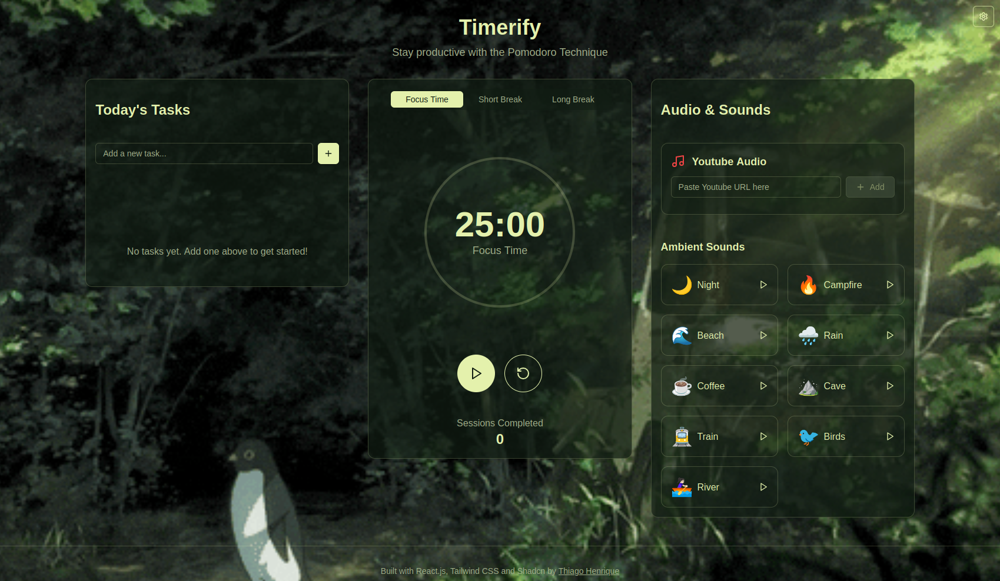

<div align="center">



# Timerify
  
**Maximize your productivity with a customizable pomodoro and immersive sound environment 🎯**  

  [View Demo](https://timerify.thiagof.com/) ·  [Report Bug](https://github.com/ythiago03/timerify/issues) ·  [Suggest Feature](https://github.com/ythiago03/timerify/issues)

</div>

## 📋 About the Project

Timerify is a pomodoro web application designed to increase your productivity during studies, work, or any other activity that requires focus. With an intuitive interface and customizable features, Timerify offers a unique experience to manage your time efficiently.

## ✨ Features

### ⏰ Customizable Pomodoro Timer


- Default timer: 25 minutes of focus. 5 min of break and 15 min long break
- Intuitive and minimalist interface
- Soft sound alerts for the start and end of each session
- Customize each time according to your needs

### 📝 Integrated Task Manager


- Create and organize your tasks for each session
- Mark tasks as completed
- Stay focused on important goals

### 🎵 Immersive Sound Environment


- Relaxing ambient sounds:
  - Gentle rain
  - Ocean waves
  - Crackling fire
  - Forest sounds
  - Coffee shop atmosphere
  - Among others
- Individual volume control for each sound
- Mix different sounds to create your perfect environment

### 🎬 YouTube Integration


- Add any YouTube video or playlist *(I personaly recomend [this playlist](https://youtu.be/2lCNYNyC54o?si=2FliuMiVpxsHkNq1) )*
- Perfect for lo-fi music, study playlists, or ambient sounds
- Independent volume control
- Continue listening even when minimizing the window

### 🎨 Custom Themes


- Various themes available:
  - Light
  - Dark
  - Forest
  - Lo-fi
  - Among others
- Adapt the interface to your taste and environment

### 👤 Custom Profiles


- Customize the pomodoro timer, theme and save it in a profile

## 📝 Future Improvements

Features that I plan to implement:

- More Languages
- Save your created YouTube playlists
- Ranking of pomodoro hours completed
- Ranking of pomodoro sessions completed (in total)
- Ranking of tasks completed

## 🚀 Technologies Used

- [Next.js](https://nextjs.org/) - React framework for production
- [Tailwind CSS](https://tailwindcss.com/) - Utility-first CSS framework
- [YouTube IFrame API](https://developers.google.com/youtube/iframe_api_reference) - API for YouTube integration
- [Shadcn/ui](https://ui.shadcn.com/) - Component library

## 🎵 Audio Credits

| Ambient Sound | Original Link | Author |
|--------------|---------------|--------|
| Night Ambience | [Link to original audio](https://pixabay.com/sound-effects/night-ambience-with-cricket-sound-271304/) | TanwerAman |
| Crackling Fire | [Link to original audio](https://pixabay.com/sound-effects/campfire-crackling-fireplace-sound-119594/) | SoundsForYou |
| Sandy Beach | [Link to original audio](https://pixabay.com/sound-effects/sandy-beach-calm-waves-water-nature-sounds-8052/) | juliusH |
| Rain Ambience | [Link to original audio](https://pixabay.com/sound-effects/calming-rain-257596/) | Liecio | 
| Coffee Shop Ambience | [Link to original audio](https://pixabay.com/sound-effects/ambience-coffee-shop-4-17028/) | freesound_community |
| Dripping Water in Cave | [Link to original audio](https://pixabay.com/sound-effects/dripping-water-in-cave-114694/) | solarmusic |
| Inside Old Train | [Link to original audio](https://pixabay.com/sound-effects/inside-old-train-169418/) | kokoreli777 |
| Dripping Water in Cave | [Link to original audio]() | solarmusic |
| Calm Zen River Flowing | [Link to original audio](https://pixabay.com/sound-effects/calm-zen-river-flowing-228223/) | Alex_Jauk |

## 🛠️ Installation and Usage

```bash
# Clone the repository
git clone https://github.com/ythiago03/timerify.git

# Enter the project folder
cd timerify

# Install dependencies
npm install

# Start the development server
npm run dev
```

Access [http://localhost:3000](http://localhost:3000) in your browser to see the app running.

## 🤝 Contributing

Contributions are always welcome! To contribute:

1. Fork the project
2. Create a branch for your feature (`git checkout -b feature/AmazingFeature`)
3. Commit your changes (`git commit -m 'feat: Add some AmazingFeature'`)
4. Push to your branch (`git push origin feature/AmazingFeature`)
5. Open a Pull Request

## 📝 License

This project is licensed under the MIT License. See the [LICENSE](LICENSE)

<div align="center" style=>
 Developed with ❤️ to boost productivity for everyone by <a href="https://thiagof.com/" target="_ blank">Thiago Fidêncio.</a>
</div>

